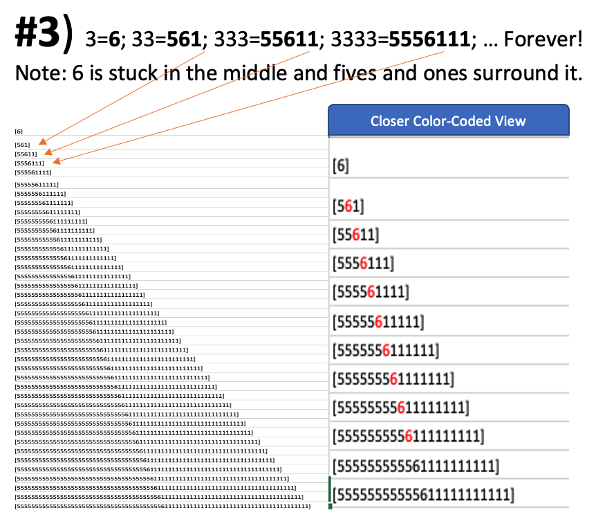
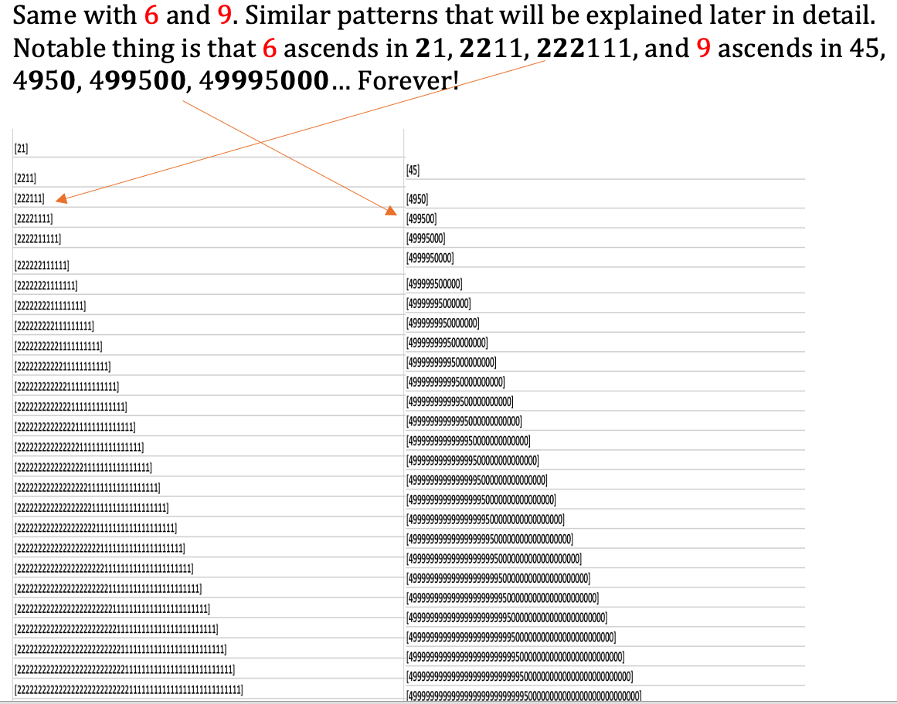
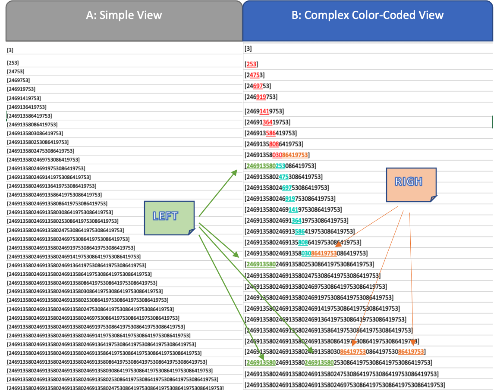
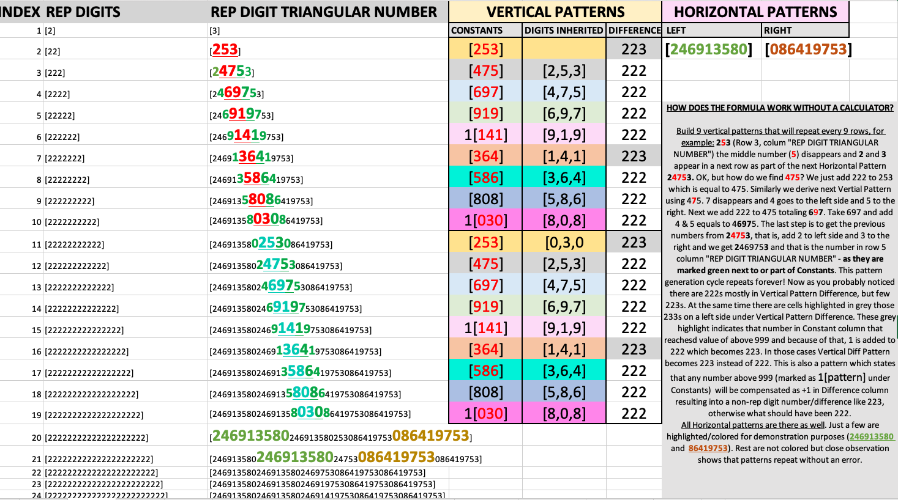
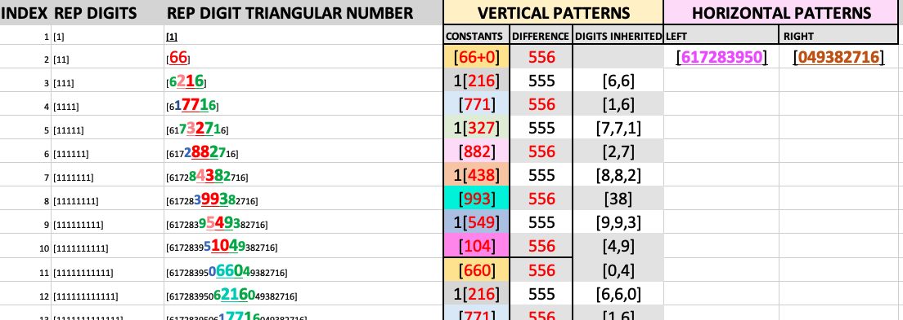
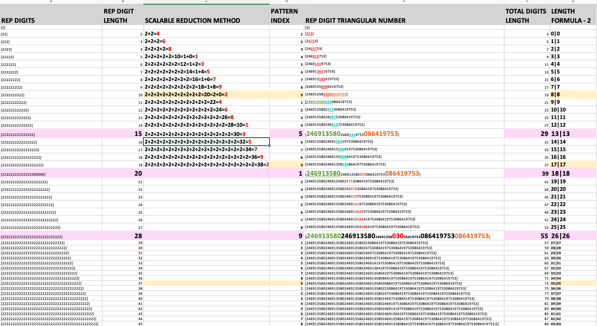
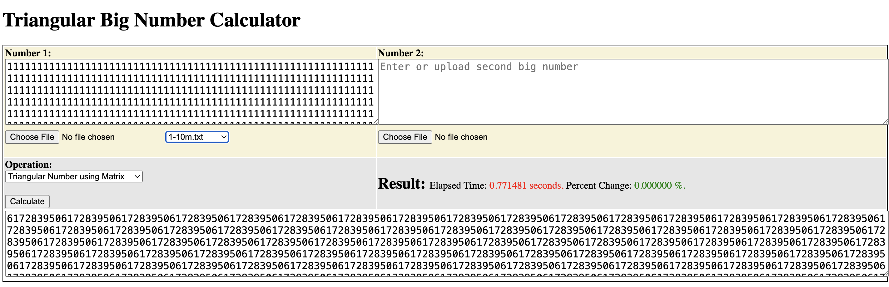
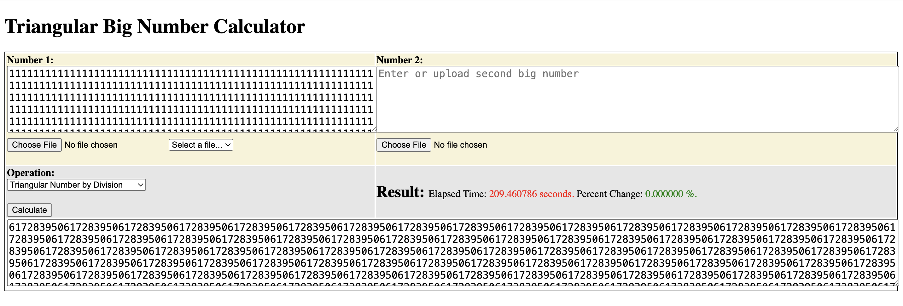
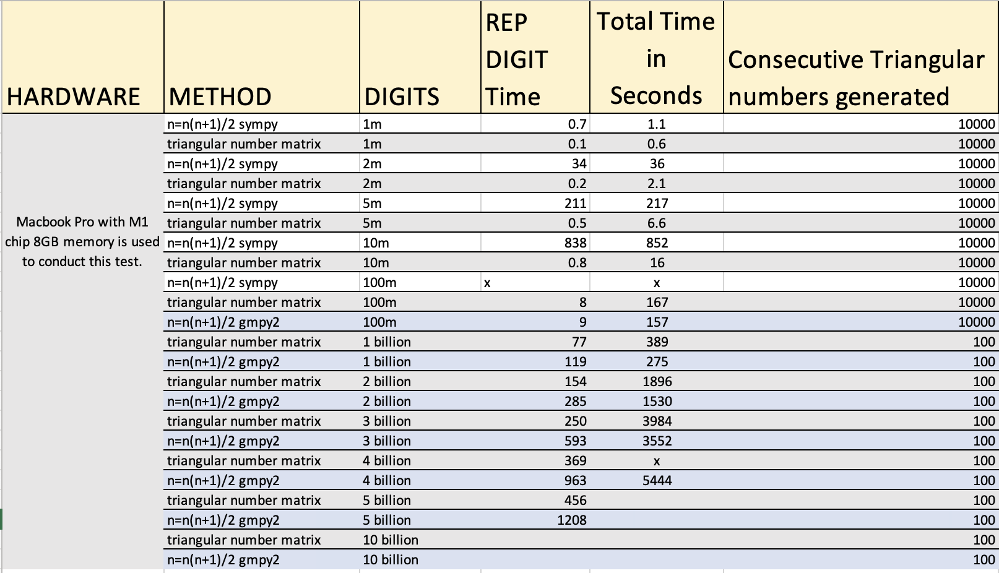

# Triangular Numbers Matrix

# Python Calculator
To run the triangular number python calculator download this repository. You'll need python3 installed and to install requirements through <b>pip install -r requirements</b>. Then run <b>python3 app.py</b>. UI is accessible through the browser at the following address: http://127.0.0.1:5000.

Calculator is limited to calculating only rep digit numbers, however you can generate subsequent large non-rep digit numbers following the sequense 1+2+3+4... Currently its been tested upto 5 billion digits. You can find more instructions in the Calculator UI. Calculator is in a very early stage and will acquire more features soon.

# Discussion about how calculator works

## Problem
The proposal is to build a new Trainagular Numbers system that uses patterns and constants to create shortcuts into calculating astronomically high triangular numbers that cannot be calculated using modern computer systems since they are slow at this task and often fail at high numbers. They fail to devide large numbers that is required by the <b>Tn=n(n+1)/2</b> formula, and during success they are very slow. If you want to calculate a triangular number that has 10 trillion digits you run into a problem because of current formula is <b>Tn=n(n+1)/2</b> or response is very slow. For example, if <b>n=36th</b>, triangular number can be calculated as <b>36(36+1)/2=(36*37)/2=666</b>. We can also hand calculate this using the following method <b>1+2+3+4+5+6+7+8+9+10+11…36=666</b>. But what if instead of 36 which is a 2-digit number, we want to calculate 10-trillion-digit number’s Triangular Number? Most of the methods that mentioned above won’t work efficiently, and it maybe needed to be mixed with hand calculation techniques which will be very slow.

## Solution
Proposed Triangulal Matrix System works on <b>universal mathematical patterns and constants</b>, as if we can see inside of each digit exposing internal patterns and navigation mechanism that allows almost instatations jump into building the answers from the patterns instead of calculating the end result.

Two Premises with Triangulal Matrix System:
     1) With large numbers the system overcomes in speed <b>Tn=n(n+1)/2</b> in all rep degits calculations.
     2) With large numbers The system overcomes <b>Tn=n(n+1)/2</b> in speed some NON-rep degit traingular numbers that are close to rep digits.

To overcome this slowlines problems with  problems with <b>Tn=n(n+1)/2</b> and better scale the calculation process, we use a rep digit formula that gives us <u><i>pattern level access</u></i> (like a portal) that can with a light speed calculate any rep-digit’s Triangular Number. For example, let’s take a number 3 and turn into a 10 billion rep-digit in order to calculate its Triangular number (<b>3333</b>… up to 10 billion) would always result into a <b>“555555555…561…111111111”</b> <u><i>number pattern</u></i> which we can easily generate by using scalable techniques that can be parallelized on different machines and assembled as a final result. This, in turn gives us an ability to quickly jump and know the triangular number of “3333… up to 10 billion-th digit”, and from thereon if we want to calculate a triangular number of n-th digit we can just – 1 till we reach the digit that we desire, the n-th digit. We can just minus that 1 using hand calculation technique without any optimizations. This logic can be applied to calculate the desired Triangular Numbers by first jumping into the nearest rep-digit Triangular Number and later <u>counting down</u> from there to find the <b>desired number’s Triangular Number</b>.

To better understand we must visualize patterns of digits from 1 to 9 since these are the only real numbers in Hexadecimal system. Let’s look at their patterns in a bird’s eye view that is visible to a human eye with careful observation. First start with simplest patterns of 3, 6, and 9. For example <b>n=3</b> the Triangular number would be 1+2+3=<b>6</b>. With division method for <b>n=33</b> Triangular number would be (33+34)/2=<b>561</b>. Further <b>n=333</b> would result into <b>55611</b>. Now look how pattern evolves.

<b>1, 2, 4, 5, 7, 8</b> have complicated patterns that will be discussed in detail. However, below image serves to demonstrate that triangular patterns are visible to a human eye after carful observation (<i>they appear to have triangular shapes</i>). These are patterns for <b>n=2</b>, first picture is <u><i>Simple View</i></u> and another one is <u><i>Complex Color-Coded View</i></u> to emphasize these very patterns when <b>n=2</b>. <b>NOTE</b>: both Vertical and Horizontal patterns for 1, 2, 4, 5, 7, 8 are complicated compared to numbers 3, 6 and 9. 

<u><i>Complex Color-Coded View</i></u> shows that there is a <u><b>3</b> digit <b>Constant</b> (red & blue)</u> in another words <b>“Vertical Patterns”</b> in the middle. In addition it shows “<i>Right</i> <b>Horizontal Patterns</b>” (beige) and “<i>Left</i> <b>Horizontal Pattern</b>” (green). <u><b>3</b> digit <b>Constant</b> (red & blue)</u> repeats every <u><b>9</b> times</u> that is why it is color coded in 2 colors to demonstrate this <i>cycle</i>. Left and Right Horizontal patterns for 1,2,4,5,7,8 consist of 9 digits as well in case of <b>n=2</b> it’s “<i>Left</i> <b>Horizontal Pattern</b>” is <b>086419753</b> and “<i>Right</i> <b>Horizontal Pattern</b>” is <b>246913580</b> as annotated in <u><i>Complex Color-Coded View</u></i>. These patterns are everywhere in 1,2,4,5,7,8 without a break in a pattern, only few are highlighted for <b>n=2</b> for demonstration purposes, but a closer examination shows that either they show <i>full patterns</i> or <i>partial patterns</i>.

Lets define some critical terms for the next slide so that we organize the visual aid using specific arrangement and terminology using <b>n=2</b> as an example:

### Vertical Patterns
-	<b>Constants</b>: <b>253, 475, 697, 919, 141, 364, 586, 808, 030</b>. Totaling <b>9</b> constants that repeat forever. These constants will be used what’s going to be in the mid-section of the Triangular Number for rep-digit 2’s ascension to higher dimensions 22, 222, 2222, etc.
-	<b>Digits Inherited</b>: As you will see in a next slide predominantly digits from <b>Constants</b> make up the <b>Horizontal Pattern</b> and these metric outlines which digits are inherited from Vertical Pattern into Horizontal Pattern since Vertical Patterns (<b>Constants</b>) participate in creation of Horizontal Pattens. Both Vertical Patterns having <u><i>9 Constants</i></u>, and <b>Horizontal Patterns</b> having <u><i>9 digits</u></i> that are derived from or relate to <b>Vertical Patterns</b>.
-	<b>Difference</b>: refers to difference between consecutive <b>Constants</b>. For example, <b>253</b>+222=<b>475</b> or <b>697</b>+222=<b>919</b>. So, difference in this case is <u><i>222(rep-digit)</i></u>. Rep-digits are predominant <b>Difference</b> between the <b>Constants</b>, sometimes they are off by one – instead of 222 you’d see 223, <i>but that is also a pattern within a pattern which will be later explained</i>.

### Horizontal Patterns
-	<b>Left Horizontal Pattern</b> – this represents the patterns or parts of patterns that repeat horizontally <b>086419753</b>. We are going to use this pattern to automatically generate Triangular Numbers without the need to calculate explicitly. Append from left side to <b>Constant</b>.
-	</b>Right Horizontal Pattern</b> – this represents the patterns or parts of patterns that repeat horizontally <b>246913580</b>. We are going to use this pattern to automatically generate Triangular Numbers without the need to calculate explicitly. Append from right side to <b>Constant</b>.

In essence what we are trying to do is to append as many <b>Right Horizontal Patterns</b> from the right side of the <b>Constant</b> (that is in the middle) before we reach the <b>Constant</b>, and then append <b>Left Horizontal Patterns</b> from the left side until we reach the <b>Constant</b> in the middle from the left side. This way we are more of an assembling Triangular Number in pieces of patterns rather than calculating directly, <u><i>which saves time and effort to calculate when it comes to a large Triangular Numbers</i></u>.

### Additional Terms
-	<b>Index</b> – serves as an index of a number, for example in the case of n=2 the index is 1, and in case of n=22 the index is 2 and so on. It also tells the length of the digits in a rep-digit number. For example, the length for n=2 is 1, and for n=22 is 2.
-	<b>Rep Digits</b> – this column represents “n”-th number itself for example 2, 22, 222, 2222, 22222 and so on. The number that we are trying to get the Triangular Number for.
-	<b>Rep Digit Triangular Number</b> – this column is the actual Triangular number for the corresponding “n”-th number (rep-digit). That’s where all patterns are, and this column is most important since it allows construction of patterns to create a high-speed like rail track to construct/generate this number on a fly using “Pattern Padding to Constant” approach to build value horizontally for Triangular Number at hand.

### Summary
-	Next slide called “<b>Rep Digit System</b>” will go over in more detailed explanation and place everything that has been discussed in more organized format. <b>NOTE</b>: Each number has its own “Rep Digit System” with similar rules and minor exceptions see xlsx doc for full data for all rep digits from 1 to 9 - not just for <b>n=2</b> as per this example. It’s critical to understand how data is organized to move forward so take your time observing these patterns.

There are <u><i>some exceptions</i></u> with the other digits that are not depicted in this document. Those are in <b>dark-blue</b> as part of Horizontal Pattern under “<b>REP DIGIT TRIANGULAR NUMBER</b>” in xlsx document (snippet in pic below), those numbers seem to appear out of nowhere and not directly related to the Vertical Patten above it, however, they don’t break the overall formula or Vertical or Horizontal patterns. Look at example for number <b>n=1</b> instead of number <b>n=2</b> to see this when referring to xlsx doc for all exceptions. Below pic shows some of these exceptions when <b>n=1</b>.

Let’s summarize what we learned so far and what we need to formulate a strategy to accelerate production of Triangular Numbers (using <b>n=2</b> as an example):

1.	<b>Left Horizontal Pattern</b>: Append to the Constant from the left.
2.	<b>Constant</b>: Place it in the middle.
3.	<b>Right Horizontal Pattern</b>: Append to the Constant from the right.

So that we have the following “n”-th rep digit 22222222222, 11th rep- digit number (check the chart for number <b>n=2</b> above), and to get the Triangular Number we would need:

                            Left Pattern + Constant + Right Pattern

2222222222 = 246913580  >> <b>253</b> << 086419753 = 246913580<b>253</b>086419753.

Since it’s patten number <b>11th</b> and that also represents the length of digits in 2222222222, we just need to subtract from length (11) – 2 = <b>9</b>. Now we know with this formula that Left and Right patterns both must be length of <b>9</b> let’s call it a “Length Formula - 2”. So we append <b>9</b> digits of patterns from both sides from left and right to the <b>Constant</b>. How do we find the <b>Constant</b> of <b>253</b>? We use a “<b>Scalable Reduction Method</b>” explained later to get the pattern index for <b>253</b>.

Double check the provided charts above so that you are in clear what just happened, and that the result Triangular Number was derived from constants and patterns and not really calculated through traditional methods like Tn=n(n+1)/2.

Next lets check more complex example where deriving a Triangular Number requires more work since patterns are cutoff and not fully formed yet. The following is the formula:

                        Left Patterns + Left Cutoff + Constant + Right Cutoff + Right Patterns

So that we have the following “n”-th rep digit 22222222222222222, <b>16</b>th rep-digit number (lenght=16) and to get the Triangular Number we would need first to use <b>“Length Formula - 2”</b> formula: 16 – 2 = <b>14</b>. That would be the length of the patterns from each side surrounding the <b>Constant</b>. Now <b>14</b> has one 9 in there, and remainder is <b>5</b>. Best “scalable” way to calculate remainder is to sum its digits, in this case 14=1+4=<b>5</b>, and 5 is the remainder. Now we know we need both, how many times to use Left/Right Pattern ((14-5)/9=<b>1</b>) and what is the Left/Right Cutoff (<b>5</b>) pattern. Notice this is the first long hand-division we most likely have to perform, but it should be fast since only dividing by 9 and not by a long number. The <b>Constant</b> for this division we find using “<b>Scalable Reduction Method</b>” – see the following “<b>Triangular Numbers Matrix</b>” table for number 2 to see how these methods and new terminology apply. It’s “Scalable” since we can add up 2+2+2+2+2+2… separately as 2+2+2 and plus 2+2+2 and parallelize the process, whereas in <i><u>hand division or multiplication of big digits</i></u> we cannot parallelize effectively.

Main idea of this document is to build an Open Source POC software that would compare and optimize this methodology against other methodologies and find the fastest way to calculate astronomical Triangular Numbers on demand with different scalability options. Below you can find the actual results of the calculating using Devision vs Trainagular Numbers Matrix only for rep digits. Soon to post results for regular digits... Stats will be updated with higher numbers and more granular stats.

## Matrix
Ran under 1 second processed 10 million digit number and produced correct result.

## Tn=n(n+1)/2
Ran over 200 seconds it took to process 5 million records. Wasn't able to run 10 million records.

## Tn=n(n+1)/2
Results using sympy and gymp2 vs Triangular Matrix system

## Sidenote: Symmetry
1) There is a noticable symatry between 3 6 and 9 in it's symplicity. Also there is a symmetry in "difference metrics" such as 3 points to 6, 6 points to 3 and 9 points to 9 using the following method ie for <b>6</b> would be 222111 or if number is "split" in half 222 and 111 and that adds up to 333, thus 6 is pointing to 3. 

* 3= 555555555 + 6 + 11111111 = 666666666
* 6= 222222222 + 111111111 = 333333333
* 9= 499999999 + 500000000 = 999999999

When squared these numbers add up to the same when reduced ie 3*2=6 6*2=12=1+2=3 12*2=24=2+4=6 24*2=48=4+8=12=1+2=3 and so on. As in Teslas' famios video about 3, 6, and 9. Also Complex numbers match the numbers in the same video for being separate and different from 3, 6, 9. 

2) Additionally there is a pattern in "difference" as well: 1 points to 8, 2 points to 7 and 4 points to 5. This is a representative of another pattern. ie 1 has a "difference" of 555 so it point to numbe 8 since it also has difference of 555.

3) Complex patterns of 1, 2, 4, 5, 7, 8 also end up as rep digits by combining their horizontal patterns in "split" fashtion. Full list of numbers through 1 to 9 all with <b>rep-digit hash keys</b>:

* 1= 617283950 + 049382716 = 111111111
* 2= 246913580 + 086419753 = 111111111   # remove 0-s
* 3= 555555555 + 6 + 11111111 = 666666666
* 4= 876543209 + 123456790 = 999999999
* 5= 543209876 + 123456790 = 666666666
* 6= 222222222 + 111111111 = 333333333
* 7= 024691358 + 086419753 = 111111111
* 8= 395061728 + 049382716 = 444444444
* 9= 499999999 + 500000000 = 999999999