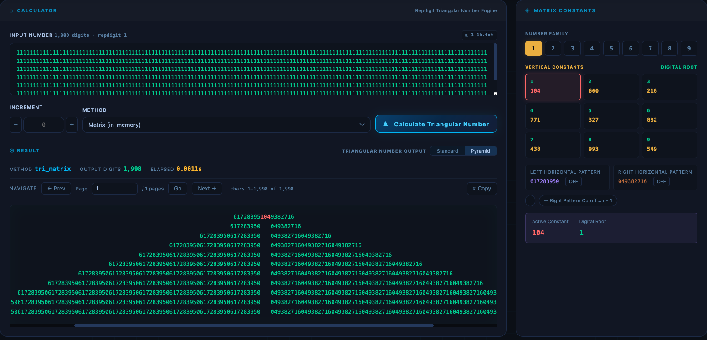
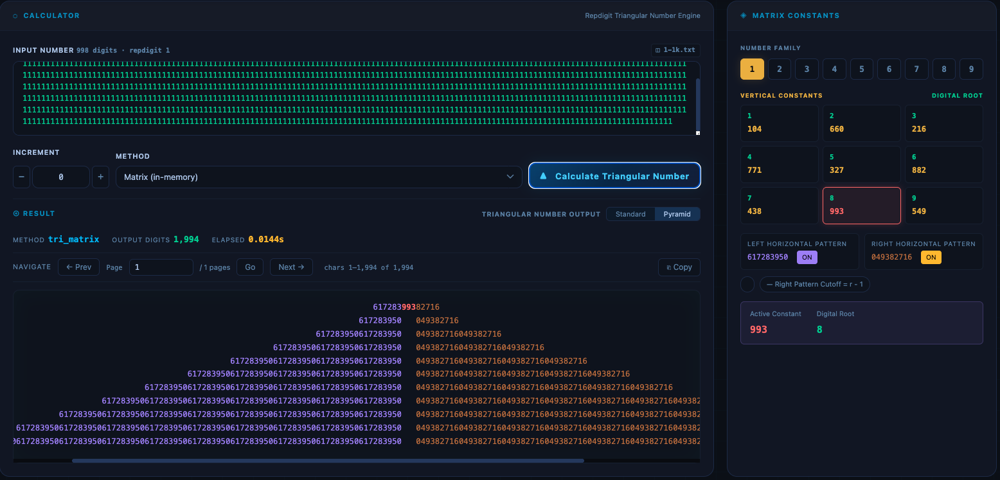
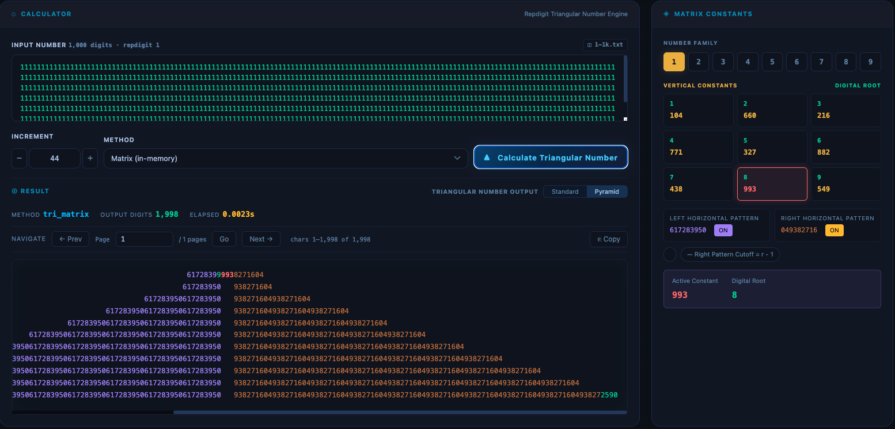
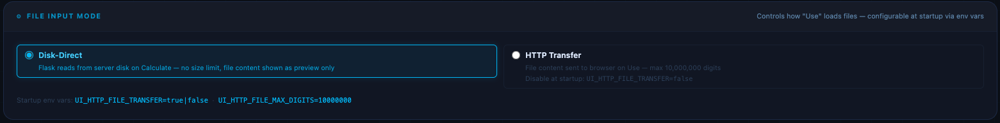
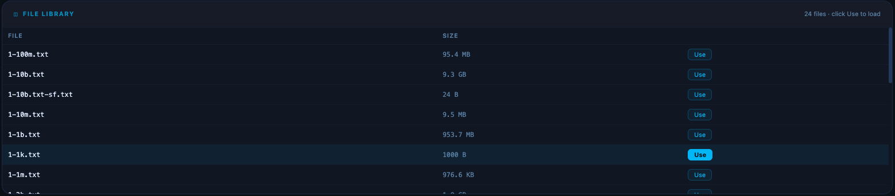
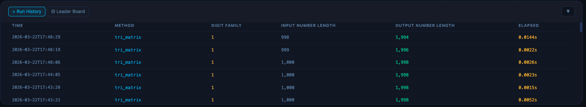
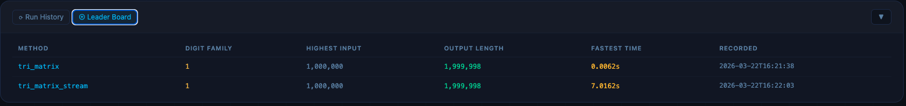
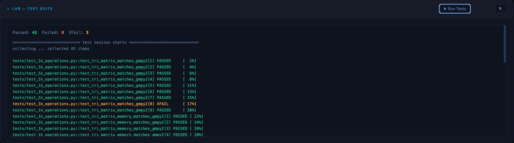

# Triangular Number Matrix — Calculator

An interactive research tool for computing, visualizing, and benchmarking triangular numbers derived from repdigit inputs. Built for researchers working with the Triangular Number Matrix theory, it provides multiple computation methods, a geometric pyramid visualization with pattern highlighting, persistent run benchmarking, and an in-browser test suite.

---

## Table of Contents

- [Installation](#installation)
- [Running the App](#running-the-app)
- [Calculator Panel](#calculator-panel)
- [Matrix Constants Panel](#matrix-constants-panel)
- [Result Output — Standard and Pyramid Views](#result-output--standard-and-pyramid-views)
- [Pattern Highlighting (Left / Right Horizontal Patterns)](#pattern-highlighting-left--right-horizontal-patterns)
- [Increment Stepping](#increment-stepping)
- [File Input Mode](#file-input-mode)
- [File Library](#file-library)
- [Run History](#run-history)
- [Leader Board](#leader-board)
- [Lab — Test Suite](#lab--test-suite)

---

## Installation

**Requirements:** Python 3.10+

**1. Clone the repository**

```bash
git clone https://github.com/your-org/triangular-number-matrix.git
cd triangular-number-matrix
```

**2. Create and activate a virtual environment**

```bash
python -m venv venv
source venv/bin/activate      # macOS / Linux
venv\Scripts\activate         # Windows
```

**3. Install dependencies**

```bash
pip install -r requirements.txt
```

Dependencies include: `Flask`, `gmpy2`, `sympy`, `numpy`, `gunicorn`, `pytest`.

> **Note:** `gmpy2` requires GMP to be installed on your system.
> - macOS: `brew install gmp`
> - Ubuntu/Debian: `sudo apt install libgmp-dev`

---

## Running the App

```bash
python app.py
```

The server starts on `http://127.0.0.1:5000` in debug mode by default.

**Optional environment variables:**

| Variable | Default | Description |
|---|---|---|
| `UI_HTTP_FILE_TRANSFER` | `true` | Enable HTTP transfer mode for file loading |
| `UI_HTTP_FILE_MAX_DIGITS` | `10000000` | Max digits transferred via HTTP (10 million) |

---

## Calculator Panel



The **Calculator** panel is the primary interface. Enter a repdigit number in the **Input Number** textarea — the app instantly detects the digit family and length, displaying a summary (e.g. `1,000 digits · repdigit 1`) in the corner of the field.

**Method** selects the computation engine:

| Method | Description |
|---|---|
| `Matrix (in-memory)` | Fast in-memory matrix computation |
| `Matrix Memory (chunked)` | Chunked processing for large inputs |
| `Matrix Stream (disk write)` | Streams result directly to disk |
| `Matrix Random (shortform)` | Random-access shortform calculation |
| `Division gmpy2 (baseline)` | GMP-accelerated division baseline |
| `Division sympy` | SymPy-based division method |

Click **Calculate Triangular Number** to run. The result appears immediately below in the Result section without a page reload.

---

## Matrix Constants Panel


The **Matrix Constants** panel on the right displays the full set of constants for the detected digit family.

- **Digit Family selector** (buttons 1–9) — manually browse constants for any digit family. The active digit is highlighted.
- **Vertical Constants grid** — all nine vertical pattern constants for the selected digit family. The active constant (matching the computed result) is highlighted in violet, with its **Digital Root** shown alongside.
- **Left Horizontal Pattern** and **Right Horizontal Pattern** — the repeating tile patterns that appear on either side of the vertical constant in the triangular number.
- **Active Constant** and **Digital Root** readouts at the bottom.

The panel updates automatically after every calculation — including after increment operations — to always reflect the constants present in the current result.

---

## Result Output — Standard and Pyramid Views

Results are displayed in two switchable modes using the **Standard** / **Pyramid** toggle in the result bar.

**Standard view** shows the raw triangular number in a scrollable, paginated window (10,000 digits per page). Use the **Navigate** controls — Prev, Next, Go to page — to move through large results. The page indicator shows the current character range (e.g. `chars 1–1,998 of 1,998`).

**Pyramid view** renders the geometric structure of the triangular number:

- The vertical pattern constant sits at the apex
- Left and right horizontal pattern tiles radiate outward row by row below the apex, growing one tile per row on each side
- Up to 10 rows are shown, representing the innermost tiles closest to the constant

Pyramid view is available for results up to 10,000 digits. For larger results the view automatically switches to Standard.

---

## Pattern Highlighting (Left / Right Horizontal Patterns)



The **Left Pattern** and **Right Pattern** toggle buttons in the Matrix Constants panel activate fuzzy-match highlighting in Pyramid view.

- **Left pattern** (purple) — each tile in the left horizontal pattern is compared character-by-character against the expected left pattern. Matching characters are highlighted purple; differing characters remain green.
- **Right pattern** (amber) — same comparison against the right pattern. Matching characters are highlighted amber; differing characters remain green.

This is particularly useful after an increment operation: the inner tiles that are unchanged appear fully colored, while the tile adjacent to the constant — where the increment carry propagated — shows only its changed characters in green, identifying exactly which digits were affected by the increment.

Toggle state is preserved across file switches and page navigation.

---

## Increment Stepping



The **Increment** field adds a fixed value to the computed triangular number before returning the result. This allows exploration of how the triangular number and its embedded constants change when the input is shifted by a small amount.

The `−` and `+` stepper buttons flanking the Increment field allow one-click stepping: each press adjusts the increment value by 1 and immediately triggers a new calculation. This makes it easy to step through consecutive increments and observe pattern changes in the pyramid view without re-entering values manually.

Reducing the digit count directly in the Input Number textarea (e.g. removing one digit from a repunit) also recalculates automatically, and the Matrix Constants panel updates to show the constants for the new input length — useful for observing how constants shift as the repdigit length changes.

---

## File Input Mode



The **File Input Mode** panel controls how files from the File Library are loaded into the calculator.

- **Disk-Direct** — Flask reads the file from server disk at calculation time. No size limit. The file content is shown as a preview only in the textarea; the full file is passed directly to the computation engine. Recommended for very large inputs (hundreds of megabytes to gigabytes).
- **HTTP Transfer** — The file content is sent from the server to the browser on selection, capped at `UI_HTTP_FILE_MAX_DIGITS` (default 10,000,000 digits). Suitable for moderately large files when you want to inspect the raw input in the textarea before calculating.

Both modes are configurable at startup via environment variables: `UI_HTTP_FILE_TRANSFER=true|false` and `UI_HTTP_FILE_MAX_DIGITS=10000000`.

---

## File Library



The **File Library** panel lists all pre-generated repdigit input files available on the server, along with their sizes. Files follow the naming convention `{digit}-{size}.txt` (e.g. `1-1k.txt`, `1-100m.txt`, `1-10b.txt`).

Click **Use** next to any file to load it into the Input Number field. The Matrix Constants panel updates immediately to reflect the digit family and length of the selected file. The currently selected file is highlighted.

Files range from small test inputs (1,000 digits, 1 KB) up to multi-billion digit files. For files exceeding the HTTP transfer limit, switch to Disk-Direct mode before selecting.

---

## Run History



The **Run History** tab records every successful calculation with full metadata: timestamp, method, digit family, input number length, output number length, and elapsed time. The most recent 100 runs are retained and displayed newest-first.

History is persisted to `static/output/stat-files/run_history.json` and survives server restarts.

| Column | Description |
|---|---|
| Time | ISO timestamp of the run |
| Method | Computation method used |
| Digit Family | Repdigit digit (1–9) |
| Input Number Length | Character count of the input |
| Output Number Length | Character count of the triangular number result |
| Elapsed | Wall-clock computation time in seconds |

---

## Leader Board



The **Leader Board** tab (accessible via the tab switcher at the top of the panel) shows the all-time best run per computation method — defined as the run with the highest input length. Ties in input length are broken by fastest elapsed time.

Unlike Run History, the Leader Board is never evicted. It persists permanently to `static/output/stat-files/leaderboard.json` and updates automatically whenever a new run beats the current record for its method. This makes it a reliable long-term benchmark across sessions.

Results are sorted by highest input length descending.

| Column | Description |
|---|---|
| Method | Computation method |
| Digit Family | Repdigit digit used in the record run |
| Highest Input | Largest input length achieved for this method |
| Output Length | Resulting triangular number length |
| Fastest Time | Best elapsed time at that input size |
| Recorded | Timestamp of the record run |

---

## Lab — Test Suite



The **Lab — Test Suite** panel runs the full `pytest` test suite in-browser without leaving the UI. Click **Run Tests** to execute. Results are displayed with color-coded output: passing tests in green, expected failures (`xfail`) in yellow, and any unexpected failures in red.

The test suite covers all computation methods against known-correct outputs for 1,000-digit repdigit inputs. A small number of tests are marked as expected failures for known open research questions — these are intentional and do not indicate a broken installation.

To run the test suite from the command line:

```bash
pytest tests/
```

Expected baseline: `42 passed, 3 xfailed`.
