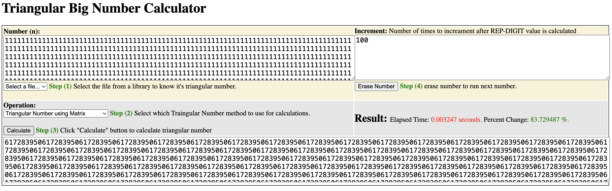

# Triangular Numbers Matrix

# Python Calculator
To run the triangular number python calculator download this repository. You'll need python3 installed and to install requirements.txt through <b>pip install -r requirements</b>. Then run <b>python3 app.py</b>. UI is accessible through the browser at the following address: http://127.0.0.1:5000.

Calculator is limited to calculating only rep digit numbers, however you can generate subsequent large non-rep digit numbers following the sequense 1+2+3+4... Currently its been tested upto 5 billion digits. You can find more instructions in the Calculator UI. Calculator is in a very early stage and will acquire more features soon.

