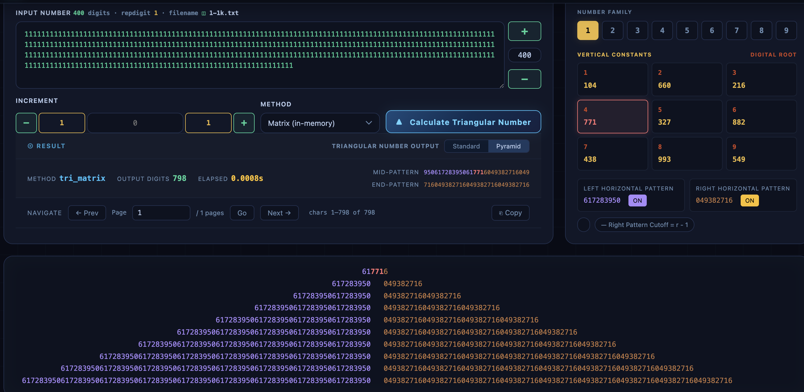
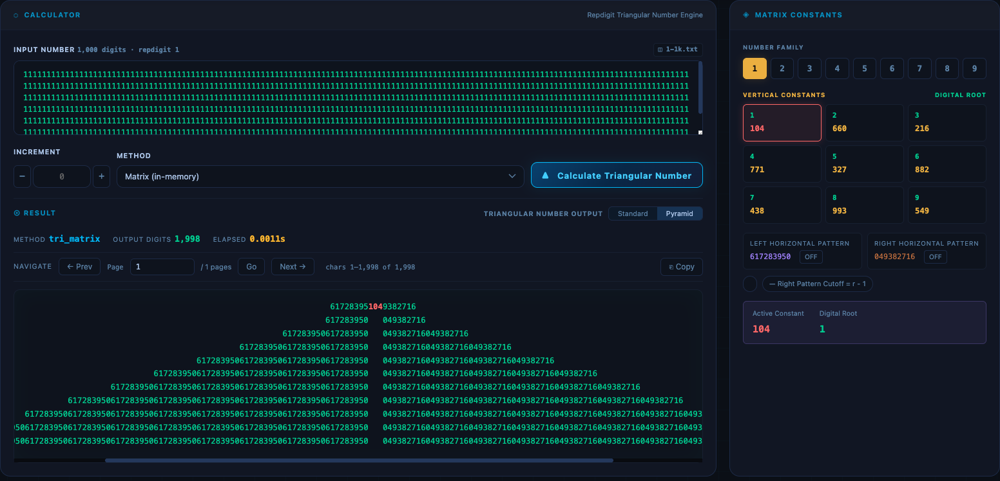
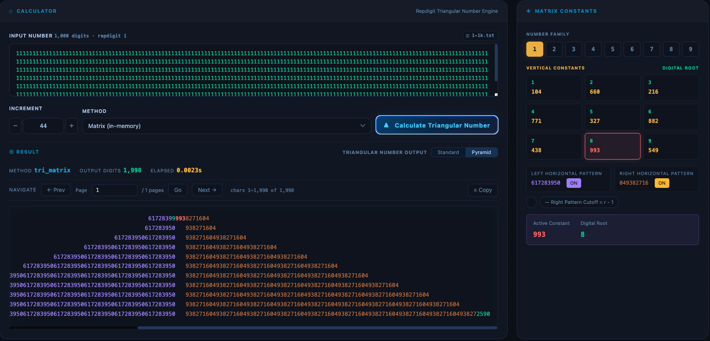
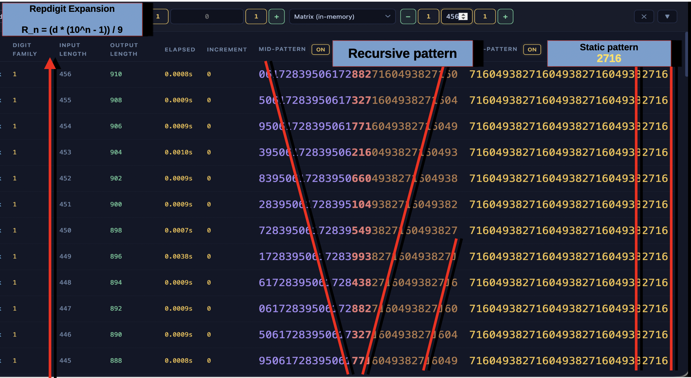
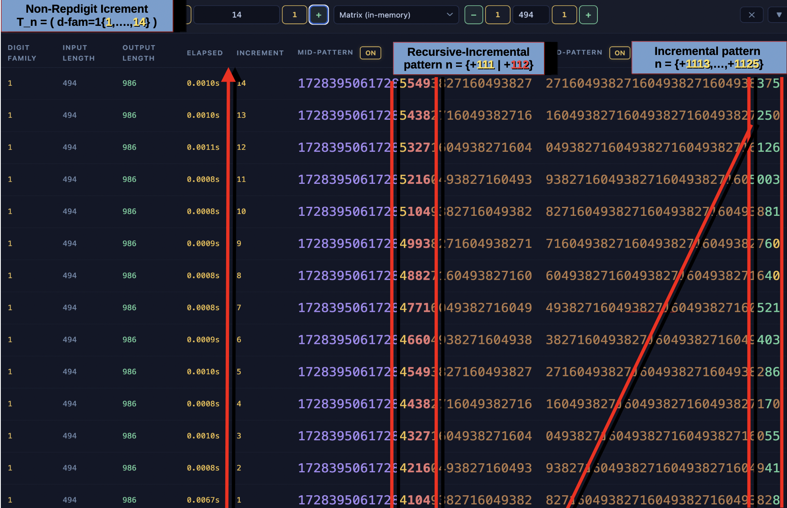
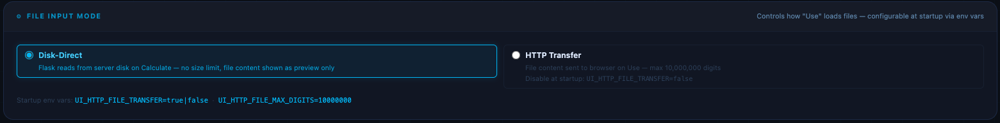
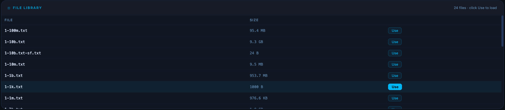
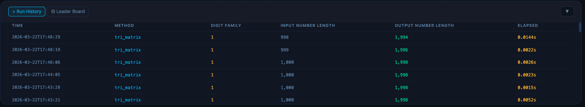
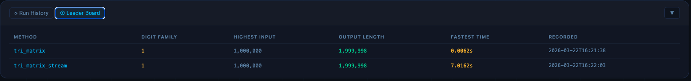
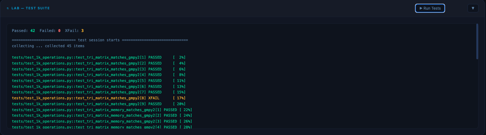

# Triangular Number Matrix — Calculator

An interactive research tool for computing, visualizing, and benchmarking triangular numbers derived from repdigit inputs. Built for researchers working with the Triangular Number Matrix theory, it provides multiple computation methods, a geometric pyramid visualization with pattern highlighting, persistent run benchmarking, and an in-browser test suite.

At its core, the calculator takes a repdigit number as input and computes its triangular number — the sum of all integers from 1 to that number. What makes this non-trivial at research scale is that repdigit inputs produce triangular numbers with deeply structured internal patterns: a central vertical pattern constant flanked symmetrically by repeating left and right horizontal tile patterns. Non-repdigit inputs (repdigit ± a small increment) expose a second layer of structure — an incremental offset geometry that is equally predictable and measurable. This tool is built to make both patterns observable, navigable, and measurable across inputs ranging from hundreds to billions of digits.



*The full interface showing a 400-digit repdigit-1 input in Pyramid view. Violet-highlighted tiles show the left horizontal pattern (HPL); the amber column is the right horizontal pattern (HPR). The Matrix Constants panel (right) shows all nine vertical constants, the active constant, digital root, and both horizontal pattern values.*

---

## Table of Contents

- [Project Structure](#project-structure)
- [Installation](#installation)
- [Running the App](#running-the-app)
- [Configuration Reference](#configuration-reference)
- [Calculator Panel](#calculator-panel)
- [Matrix Constants Panel](#matrix-constants-panel)
- [Result Output — Standard and Pyramid Views](#result-output--standard-and-pyramid-views)
- [Pattern Highlighting (Left / Right Horizontal Patterns)](#pattern-highlighting-left--right-horizontal-patterns)
- [Increment Stepping](#increment-stepping)
- [Repdigit Pattern Geometry](#repdigit-pattern-geometry)
- [Non-Repdigit Increment Patterns](#non-repdigit-increment-patterns)
- [File Input Mode](#file-input-mode)
- [File Library](#file-library)
- [Run History](#run-history)
- [Leader Board](#leader-board)
- [Lab — Test Suite](#lab--test-suite)
- [Deployment](#deployment)
- [License](#license)

---

## Project Structure

```
triangular-number-matrix/
├── app.py                  # Flask entry point
├── config.py               # All paths and tunable constants
├── requirements.txt
│
├── api/
│   └── routes/             # Flask blueprints
│       ├── calculator.py   # /calc — main compute endpoint
│       ├── files.py        # /files — file library CRUD
│       ├── lab.py          # /run-tests — pytest runner
│       └── stats.py        # /stats — leaderboard & history
│
├── core/
│   ├── calculator.py       # Computation methods (Matrix, Division, gmpy2, sympy)
│   ├── base_calc.py        # Shared arithmetic primitives
│   └── repdigit_cache.py   # VPC / pattern constant lookup
│
├── ui/
│   └── templates/
│       └── base.html       # Single-page Jinja2 template (HTMX-driven)
│
├── static/
│   ├── ui/
│   │   ├── css/main.css    # Full design system
│   │   └── js/app.js       # All client-side logic (pyramid, patterns, panels)
│   ├── numbers/            # Pre-generated repdigit input files
│   ├── configs/
│   │   └── windows.json    # Pattern window definitions
│   └── output/
│       ├── tn-files/       # Last computed triangular number (session cache)
│       ├── we-files/       # Window extraction cache
│       └── stat-files/     # run_history.json, leaderboard.json
│
├── tests/                  # pytest suite
├── scripts/                # deploy.sh and server setup scripts
├── archive/                # Legacy code (not active)
└── infra/                  # Infrastructure config (nginx, systemd)
```

---

## Installation

**Requirements:** Python 3.10+

**1. Clone the repository**

```bash
git clone https://github.com/matrixcoders-io/triangular-number-matrix.git
cd triangular-number-matrix
```

**2. Create and activate a virtual environment**

```bash
python -m venv venv
source venv/bin/activate      # macOS / Linux
venv\Scripts\activate         # Windows
```

**3. Install dependencies**

```bash
pip install -r requirements.txt
```

Dependencies include: `Flask`, `gmpy2`, `sympy`, `numpy`, `gunicorn`, `pytest`.

> **Note:** `gmpy2` requires GMP to be installed on your system.
> - macOS: `brew install gmp`
> - Ubuntu/Debian: `sudo apt install libgmp-dev`

---

## Running the App

```bash
python app.py
```

The server starts on `http://127.0.0.1:5000` in debug mode by default.

---

## Configuration Reference

All tunables live in `config.py` and can be overridden at startup via environment variables:

| Variable | Default | Description |
|---|---|---|
| `HTTP_CHAR_LIMIT` | `10000` | Max textarea characters transferred via HTTP. Files larger than this are always loaded from disk. Set to `0` to force disk-only mode. |
| `LEADERBOARD_MIN_INPUT` | `4000000000` | Minimum input digit count to qualify for the Leader Board. |
| `UI_FILE_GENERATE_ENABLED` | `false` | Set to `true` to enable the Generate button in File Library. When enabled, the `ALLOWED_FILES` allowlist is bypassed. |
| `MAX_INCREMENT` | `100000` | Maximum absolute value of the Increment field. |

**Security note:** File generation is disabled by default. The `ALLOWED_FILES` list in `config.py` controls which pre-generated files the calculator will accept. To add custom files, add their names to `ALLOWED_FILES` and place the files in `static/numbers/`.

---

## Calculator Panel



The **Calculator** panel is the primary interface. Enter a repdigit number in the **Input Number** textarea — the app instantly detects the digit family and length, displaying a summary (e.g. `400 digits · repdigit 1 · filename: 1-1k.txt`) in the corner of the field.

**Input Number Length** defaults to **400 digits** on page load, pre-filled with the 400-digit repunit for digit family 1. The length stepper (▲ / ▼ buttons beside the textarea) increments or decrements the input by a configurable step — by default 1 digit per click. Each step immediately triggers a recalculation.

**Method** selects the computation engine:

| Method | Description |
|---|---|
| `Matrix (in-memory)` | Fast in-memory matrix computation |
| `Matrix Memory (chunked)` | Chunked processing for large inputs |
| `Matrix Stream (disk write)` | Streams result directly to disk |
| `Matrix Random (shortform)` | Random-access shortform calculation |
| `Division gmpy2 (baseline)` | GMP-accelerated division baseline |
| `Division sympy` | SymPy-based division method |

Click **Calculate Triangular Number** to run. The result appears immediately below without a page reload.

**Full-screen mode:** the result panel and any sub-panel can be expanded to fill the browser window using the ⤢ icon in the panel header. Press Escape or click ⤡ to return to normal layout.

**Panel collapse:** every panel (Calculator, Constants, Result, History, Library, Lab) has a collapse toggle. Collapsed panels retain their state and can be expanded at any time.

---

## Matrix Constants Panel


The **Matrix Constants** panel on the right displays the full set of constants for the detected digit family.

- **Digit Family selector** (buttons 1–9) — manually browse constants for any digit family. The active digit is highlighted.
- **Vertical Constants grid** — all nine vertical pattern constants for the selected digit family. The active constant (matching the computed result) is highlighted in violet, with its **Digital Root** shown alongside.
- **Left Horizontal Pattern** and **Right Horizontal Pattern** — the repeating tile patterns that appear on either side of the vertical constant in the triangular number.
- **Active Constant** and **Digital Root** readouts at the bottom.

The panel updates automatically after every calculation — including after increment operations — to always reflect the constants present in the current result.

---

## Result Output — Standard and Pyramid Views

Results are displayed in two switchable modes using the **Standard** / **Pyramid** toggle in the result bar.

**Standard view** shows the raw triangular number in a scrollable, paginated window (10,000 digits per page). Use the **Navigate** controls — Prev, Next, Go to page — to move through large results. The page indicator shows the current character range (e.g. `chars 1–10,000 of 798`).

**Pyramid view** renders the geometric structure of the triangular number:

- The vertical pattern constant sits at the apex
- Left and right horizontal pattern tiles radiate outward row by row, growing one tile per row on each side
- Up to 10 rows are shown, representing the innermost tiles closest to the constant
- **Pyramid view works for all nine digit families** and accepts inputs of any length (the 10,000-digit limit from earlier versions has been removed)

**Mismatch banner:** when the increment field is non-zero and the innermost tile has changed characters (carry propagation from the increment), a banner appears above the pyramid identifying exactly which character positions changed — reported separately for the left inner tile and the right tail tile.

---

## Pattern Highlighting (Left / Right Horizontal Patterns)



The **Left Pattern** and **Right Pattern** toggle buttons in the Matrix Constants panel activate fuzzy-match highlighting in Pyramid view.

- **Left pattern** (violet) — each tile in the left horizontal pattern is compared character-by-character against the expected left pattern. Matching characters are highlighted violet; differing characters remain green.
- **Right pattern** (amber) — same comparison against the right pattern.

After an increment operation, the inner tiles that are unchanged appear fully colored while the tile adjacent to the constant — where the carry propagated — shows only its changed characters in green.

**Key behavior:** in highlighting mode, rows beyond the first (k > 1) display the expected HPL pattern rather than the raw tile, so changed characters from the increment are visible only in row k=1 where they occur. This prevents the changed tile from visually repeating in every row of the pyramid.

Toggle state is preserved across file switches and page navigation.

---

## Increment Stepping


The **Increment** field adds a fixed value to the computed triangular number before returning the result. This allows exploration of how the triangular number and its embedded constants change when the input is shifted by a small amount.

The `−` and `+` stepper buttons flanking the Increment field allow one-click stepping: each press adjusts the increment value by 1 and immediately triggers a new calculation.

**Default behavior:** on page load, the Increment field is set to `0`. The Input Number Length defaults to `400` digits. Increment and Length are independent — stepping the Length does not reset the Increment.

The maximum allowed increment is controlled by `MAX_INCREMENT` in `config.py` (default: 100,000).

---

## Repdigit Pattern Geometry



*Run History showing Digit Family 1 with Input Number Length stepping from 456 → 445, one digit at a time. Red vertical lines separate the **Recursive Pattern** (MID-PATTERN, changes with each step) from the **Static Pattern** (VPC tail, constant across all lengths).*

When you decrement the Input Number Length by 1 repeatedly — keeping the digit family fixed — the run history reveals the geometric expansion law of repdigit triangular numbers.

The formula at the top of the table, **R_n = (d × (10^(n-1)) / 9)**, describes the repdigit input as a function of digit `d` and length `n`. As `n` decreases by 1:

- The **Recursive Pattern** column (MID-PATTERN) shifts: one fewer tile appears on each side, exposing a shorter segment of the repeating pattern band.
- The **Static Pattern** column (VPC tail `2716` in the example) remains identical across every row — the vertical pattern constant is anchored regardless of input length.

This separation — shifting recursive region vs. immovable static region — is the geometric fingerprint of the repdigit expansion. The red vertical lines mark the exact boundary between the two zones, making the structure directly visible in the run history.

**How to observe this in the calculator:**
1. Load any repdigit input (e.g. `1-1k.txt`).
2. Set Increment to `0`.
3. Click the Input Number Length ▼ stepper repeatedly.
4. Watch the Run History table fill with consecutive rows — the pattern boundary shifts predictably with each step.

---

## Non-Repdigit Increment Patterns



*Run History showing fixed Input/Output Length (494/986) with Increment decrementing from 14 → 1. Red vertical lines separate the **Recursive-Incremental Pattern** (shifts with increment) from the **Incremental Pattern** (total offset from baseline, changes predictably).*

Non-repdigit inputs are structurally equivalent to a repdigit plus a carry-propagated offset. When you hold the Input Number Length fixed and step the Increment from a positive value down toward 0, the run history reveals this offset geometry.

The formula shown — **T_n = (d-fam-1(….., 18))** — identifies the baseline digit family and offset range. As the Increment steps from 14 → 1:

- The **Recursive-Incremental Pattern** (n = 111 + 112): the MID-PATTERN shifts at each increment step, with changed characters appearing at specific positions in the innermost tile adjacent to the VPC.
- The **Incremental Pattern** (n = 111, …, + 112): the cumulative pattern offset from the repdigit baseline. This column shows which character positions the carry has reached at each increment value — the carry front moves predictably through the digit string.

The innermost tile (VPC-adjacent) absorbs the carry from the increment. The mismatch banner reports the exact positions of changed characters in that tile for both the left and right sides.

**This screenshot replaces the earlier `calculator-and-matrix-constants-panels-toggles-on-no-increment.png`** — it reflects the current UI layout including the Non-Repdigit Increment panel with full column labeling.

**How to observe this in the calculator:**
1. Load a repdigit input (e.g. `1-1k.txt`).
2. Set Increment to a small value (e.g. `14`).
3. Calculate, then click the Increment `−` stepper repeatedly.
4. The Run History shows each increment's effect on the pattern — the carry front retreats toward the baseline with each step.

---

## File Input Mode



The **File Input Mode** panel controls how files from the File Library are loaded into the calculator.

- **Disk-Direct** — Flask reads the file from server disk at calculation time. No size limit. Recommended for very large inputs (hundreds of megabytes to gigabytes).
- **HTTP Transfer** — The file content is transferred from the server to the browser on selection, capped at `HTTP_CHAR_LIMIT` (default 10,000 characters). Suitable for moderately large files when you want to inspect the raw input in the textarea.

File generation (the **Generate** button) is disabled by default. Set `UI_FILE_GENERATE_ENABLED=true` at startup to enable it — this also bypasses the `ALLOWED_FILES` allowlist.

---

## File Library



The **File Library** panel lists all pre-generated repdigit input files available on the server. Files follow the naming convention `{digit}-{size}.txt` (e.g. `1-1k.txt`, `1-100m.txt`, `1-10b.txt`).

Only files listed in `ALLOWED_FILES` in `config.py` appear in the library. Click **Use** next to any file to load it. The Matrix Constants panel updates immediately to reflect the digit family and length of the selected file.

For files exceeding `HTTP_CHAR_LIMIT`, switch to Disk-Direct mode before selecting.

---

## Run History



The **Run History** tab records every successful calculation with full metadata: timestamp, method, digit family, input length, output length, elapsed time, increment, MID-PATTERN, and END-PATTERN. The most recent 100 runs are retained, displayed newest-first.

History is persisted to `static/output/stat-files/run_history.json` and survives server restarts.

| Column | Description |
|---|---|
| Time | ISO timestamp of the run |
| Method | Computation method used |
| Digit Family | Repdigit digit (1–9) |
| Input Number Length | Character count of the input |
| Output Number Length | Character count of the triangular number |
| Increment | The increment value applied to the result |
| MID-PATTERN | 30-character window centered at the result midpoint |
| END-PATTERN | Last 30 characters of the result |
| Elapsed | Wall-clock computation time in seconds |

---

## Leader Board



The **Leader Board** tab shows the all-time best run per computation method — defined as the run with the highest input length. Ties in input length are broken by fastest elapsed time.

The Leader Board persists permanently to `static/output/stat-files/leaderboard.json`. Only runs meeting the `LEADERBOARD_MIN_INPUT` threshold (default: 4 billion digits) qualify.

| Column | Description |
|---|---|
| Method | Computation method |
| Digit Family | Repdigit digit used in the record run |
| Highest Input | Largest input length achieved for this method |
| Output Length | Resulting triangular number length |
| Fastest Time | Best elapsed time at that input size |
| Recorded | Timestamp of the record run |

---

## Lab — Test Suite



The **Lab — Test Suite** panel runs the full `pytest` test suite in-browser without leaving the UI. Click **Run Tests** to execute. Results are color-coded: passing tests in green, expected failures (`xfail`) in yellow, unexpected failures in red.

The test suite covers all computation methods against known-correct outputs for 1,000-digit repdigit inputs. A small number of tests are marked as expected failures for known open research questions.

To run from the command line:

```bash
pytest tests/
```

Expected baseline: **42 passed, 3 xfailed**.

---

## Deployment

The `scripts/` directory contains server setup and deployment scripts for production use.

**Quick deploy (after code changes):**

```bash
sudo bash scripts/deploy.sh
```

This script pulls the latest code, restarts the gunicorn service, and reloads nginx.

**First-time server setup:**

```bash
bash scripts/setup-nginx.sh   # Configure nginx reverse proxy
bash scripts/setup_https.sh   # Add TLS (requires certbot)
bash scripts/build_infra.sh   # Create required directories and service files
```

**nginx routing (recommended):**

```nginx
location /tnm-calculator {
    proxy_pass http://127.0.0.1:5000;
}
```

This allows a separate homepage to serve at `/` while the calculator runs at `/tnm-calculator`.

---

## License

This project is licensed under the **Apache License 2.0**. See [LICENSE](LICENSE) for details.
